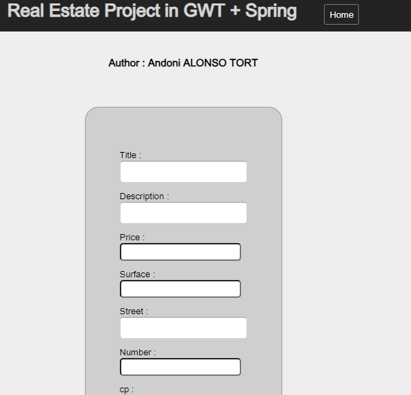

<h1
style="background:#e7e7e7;
text-align:center;
padding: 15px 0;"
>Real Estate  Spring + GWT</h1>
<h5>Author: Andoni Alonso Tort</h5>
<h5>21/10/2024</h5>

A Real Estate CRUD Project using Java Spring Boot for the Back-end and GWT for Front-end

<b>Directory back-end :</b> 
Contains the back-end project developped with Java Spring.

<b>Directory front-end :</b>
Contains the front-end project developped with GWT.

<b>Skills acquired in this project:</b>
- Management of classes between server and GWT.
- Asynchronous handling of server calls.
- HTTP requests for APIs developed in Spring.
- Use of Widgets in GWT.
- Route management.
- Interfaces Service and ServiceAsync.
- Class ServiceImpl in server.
- Database connection with PostgreSQL.
- API RESTFUL creation in Spring.
- Test data configuration in Spring.
- CrossOrigin acces.

<h5>Project description :</h5>

This application is conceived to manage estates in a web application where every user can see all the available appartments and contact the owner to buy.

<b>List of estates :</b>

In the home page we call the APIs created in our Back-end Spring, in order to show all the information as a list of appartments for the user.

I decided to add some random images event if the image storage is not even developed so we have a better visual.

<b>Action Buttons :</b>

In each container we have two action buttons.

<ul>
    <li>
        Details
        <ul>
            <li>If we clicked on this button, we'll see a new window appear with all the estate informations, including the owner's email to contact him.

            </li>
        </ul>
    </li>
    <li>Delete
        <ul>
            <li> If we click on the button delete, we will call the API DELETE created in Spring and the estate will be removed, once this call finished, the estate container in the front-end application will be automatically removed.

 We can see how we have removed all the other estates from the application.
            </li>
        </ul>
    </li>
</ul>

<b>Create new estate :</b>

In order to create a new estate we have to click fist on the green button <i>"Create Estate"</i>

This button will show a form that the user has to fill.

In this form we have to put all the informations based on our Object Model,
one we have finished, we can click on submit and create our object.

If everithing goes well and the estate is created, you will be sent automatically to the home page and you will see your estate added.

